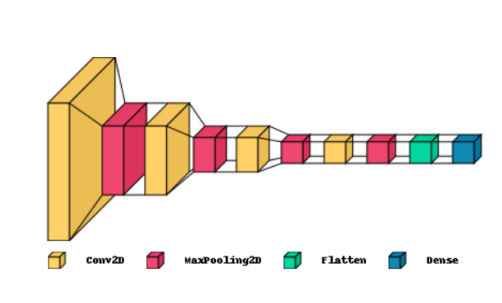

# Garbage Classification

## Problem Definition
The Garbage Classification System is an innovative project designed to revolutionize waste management by employing artificial intelligence and deep learning techniques. The system aims to address the critical issue of efficient garbage classification, enabling effective waste management and promoting environmental sustainability. Recycling trash is a crucial part of protecting our environment. Garbage must be divided into categories with similar recycling processes in order to enable the recycling process. The percentage of recycled waste can rise considerably if it is possible to separate domestic trash into several categories. Using the classes given, we trained the model in this notebook to categorize the input images and output the trash classification.

## Project Objective
* The objective of this study is to train the model to be able to predict the input images and classify it into one of the
garbage recycling categories, which includes cardboard, glass, metal, paper, plastic, trash.
* The CNN generated an accuracy score of ```92.96%``` which proved that this model has a potential to be used  a a tool for 
predicting garbage clases.
* Dataset includes cardboard(393), glass(491), metal(400), paper(584), plastic(472), trash(127)

## Home Page


## Built with
* Python
* Google Colab
* HTML
* CSS
* JavaScript

## Libraries
* tensorflow
* Sequential
* keras.layers
* ImageDataGenerator
* sklearn.metrics
* keras
* PIL
* pathlib
* scipy
* os
* numpy
* matplotlib.pyplot
* torchvisio.datasets
* torchvision.transform

## Data Preprocessing
Steps that were applied for the data preprocessing for all the images in the dataset. 
Each step is decribed below:
* ```Step 1:``` Resized all the images in the dataset to 128 x 128 pixel to match the input layer of the model
* ```Step 2:``` Converted all the images to grayscale to simplify the model's algorithm and computational requirements
* ```Step 3:``` Normalized image dataset by dividing each pixel value to 255.The pixel value ranges from 1 to 255 for each the
channels (RGB). Dividing it by 255 is necessary to normalize it to 0 to 1 range.
* ```Step 4:``` Flatten all the images into a vector matrix
* ```Step 5:``` Shuffled the train dataset for equal distribution of the data for splitting
* ```Step 6:``` Split the data into two sets - train and test. This is undergone to avoid data overfitting and to increase the model accuracy score

```CNN graph architecture based on the compiled model```


## Traning the model by using the train dataset
Epoch 1/100
39/39 [==============================] - 239s 6s/step - loss: 1.6977 - accuracy: 0.2460 - val_loss: 1.6547 - val_accuracy: 0.2766
Epoch 2/100
39/39 [==============================] - 121s 3s/step - loss: 1.5457 - accuracy: 0.3540 - val_loss: 1.5348 - val_accuracy: 0.3500
Epoch 3/100
39/39 [==============================] - 110s 3s/step - loss: 1.4780 - accuracy: 0.3642 - val_loss: 1.4560 - val_accuracy: 0.3789
Epoch 4/100
39/39 [==============================] - 115s 3s/step - loss: 1.4034 - accuracy: 0.3995 - val_loss: 1.5286 - val_accuracy: 0.3633
Epoch 5/100
39/39 [==============================] - 117s 3s/step - loss: 1.4110 - accuracy: 0.3967 - val_loss: 1.3236 - val_accuracy: 0.4531
Epoch 6/100
39/39 [==============================] - 117s 3s/step - loss: 1.3049 - accuracy: 0.4535 - val_loss: 1.2784 - val_accuracy: 0.4859
Epoch 7/100
39/39 [==============================] - 123s 3s/step - loss: 1.2501 - accuracy: 0.4815 - val_loss: 1.2497 - val_accuracy: 0.5070
Epoch 8/100
39/39 [==============================] - 115s 3s/step - loss: 1.2277 - accuracy: 0.5156 - val_loss: 1.2313 - val_accuracy: 0.5086
Epoch 9/100
39/39 [==============================] - 114s 3s/step - loss: 1.1830 - accuracy: 0.5331 - val_loss: 1.2118 - val_accuracy: 0.5328
Epoch 10/100
39/39 [==============================] - 115s 3s/step - loss: 1.1410 - accuracy: 0.5680 - val_loss: 1.1567 - val_accuracy: 0.5633
Epoch 11/100
39/39 [==============================] - 111s 3s/step - loss: 1.0802 - accuracy: 0.5895 - val_loss: 1.1705 - val_accuracy: 0.5508
Epoch 12/100
39/39 [==============================] - 120s 3s/step - loss: 1.0494 - accuracy: 0.5968 - val_loss: 1.1152 - val_accuracy: 0.5828
Epoch 13/100
39/39 [==============================] - 113s 3s/step - loss: 1.0081 - accuracy: 0.6212 - val_loss: 1.0743 - val_accuracy: 0.5992
Epoch 14/100
39/39 [==============================] - 113s 3s/step - loss: 0.9352 - accuracy: 0.6451 - val_loss: 1.0720 - val_accuracy: 0.6031
Epoch 15/100
39/39 [==============================] - 113s 3s/step - loss: 0.9265 - accuracy: 0.6480 - val_loss: 0.9482 - val_accuracy: 0.6492
Epoch 16/100
39/39 [==============================] - 123s 3s/step - loss: 0.8978 - accuracy: 0.6508 - val_loss: 0.8811 - val_accuracy: 0.6594
Epoch 17/100
39/39 [==============================] - 116s 3s/step - loss: 0.8919 - accuracy: 0.6630 - val_loss: 0.9417 - val_accuracy: 0.6562
Epoch 18/100
39/39 [==============================] - 112s 3s/step - loss: 0.8569 - accuracy: 0.6703 - val_loss: 1.0250 - val_accuracy: 0.6281
Epoch 19/100
39/39 [==============================] - 107s 3s/step - loss: 0.8740 - accuracy: 0.6594 - val_loss: 0.7927 - val_accuracy: 0.7070
Epoch 20/100
39/39 [==============================] - 107s 3s/step - loss: 0.7708 - accuracy: 0.7142 - val_loss: 1.0269 - val_accuracy: 0.6359
Epoch 21/100
39/39 [==============================] - 113s 3s/step - loss: 0.7675 - accuracy: 0.7142 - val_loss: 0.8798 - val_accuracy: 0.6812
Epoch 22/100
39/39 [==============================] - 114s 3s/step - loss: 0.7340 - accuracy: 0.7337 - val_loss: 0.7099 - val_accuracy: 0.7273
Epoch 23/100
39/39 [==============================] - 112s 3s/step - loss: 0.7216 - accuracy: 0.7389 - val_loss: 0.7620 - val_accuracy: 0.7039
Epoch 24/100
39/39 [==============================] - 107s 3s/step - loss: 0.7136 - accuracy: 0.7402 - val_loss: 0.7108 - val_accuracy: 0.7328
Epoch 25/100
39/39 [==============================] - 107s 3s/step - loss: 0.6637 - accuracy: 0.7487 - val_loss: 0.6667 - val_accuracy: 0.7563
Epoch 26/100
39/39 [==============================] - 116s 3s/step - loss: 0.6386 - accuracy: 0.7653 - val_loss: 0.6797 - val_accuracy: 0.7547
Epoch 27/100
39/39 [==============================] - 115s 3s/step - loss: 0.6293 - accuracy: 0.7605 - val_loss: 0.6554 - val_accuracy: 0.7578
Epoch 28/100
39/39 [==============================] - 115s 3s/step - loss: 0.6302 - accuracy: 0.7625 - val_loss: 0.6483 - val_accuracy: 0.7531
Epoch 29/100
39/39 [==============================] - 109s 3s/step - loss: 0.5667 - accuracy: 0.7905 - val_loss: 0.5988 - val_accuracy: 0.7805
Epoch 30/100
39/39 [==============================] - 114s 3s/step - loss: 0.5554 - accuracy: 0.7933 - val_loss: 0.5844 - val_accuracy: 0.7875
......
Epoch 90/100
39/39 [==============================] - 113s 3s/step - loss: 0.0994 - accuracy: 0.9675 - val_loss: 0.0645 - val_accuracy: 0.9805
Epoch 91/100
39/39 [==============================] - 105s 3s/step - loss: 0.0734 - accuracy: 0.9748 - val_loss: 0.1260 - val_accuracy: 0.9563
Epoch 92/100
39/39 [==============================] - 107s 3s/step - loss: 0.0564 - accuracy: 0.9817 - val_loss: 0.0929 - val_accuracy: 0.9672
Epoch 93/100
39/39 [==============================] - 113s 3s/step - loss: 0.0698 - accuracy: 0.9785 - val_loss: 0.0986 - val_accuracy: 0.9625
Epoch 94/100
39/39 [==============================] - 106s 3s/step - loss: 0.1795 - accuracy: 0.9387 - val_loss: 0.0984 - val_accuracy: 0.9633
Epoch 95/100
39/39 [==============================] - 114s 3s/step - loss: 0.1633 - accuracy: 0.9419 - val_loss: 0.1174 - val_accuracy: 0.9680
Epoch 96/100
39/39 [==============================] - 105s 3s/step - loss: 0.1429 - accuracy: 0.9537 - val_loss: 0.1734 - val_accuracy: 0.9312
Epoch 97/100
39/39 [==============================] - 114s 3s/step - loss: 0.0842 - accuracy: 0.9708 - val_loss: 0.1117 - val_accuracy: 0.9594
Epoch 98/100
39/39 [==============================] - 105s 3s/step - loss: 0.0665 - accuracy: 0.9748 - val_loss: 0.0784 - val_accuracy: 0.9711
Epoch 99/100
39/39 [==============================] - 107s 3s/step - loss: 0.0808 - accuracy: 0.9712 - val_loss: 0.1463 - val_accuracy: 0.9500
Epoch 100/100
39/39 [==============================] - 107s 3s/step - loss: 0.1040 - accuracy: 0.9659 - val_loss: 0.1078 - val_accuracy: 0.96

## Results
The image below shows the results by comparing predictions with the original garbage labels. As can be seen, all images were correctly predicted. The image classfied as ```cardboard``` has the probability of ```99%```, ```glass 87%```, ```metal 99%```, ```paper 96%```, ```plastic 83%```, and ```trash with 98%```.


